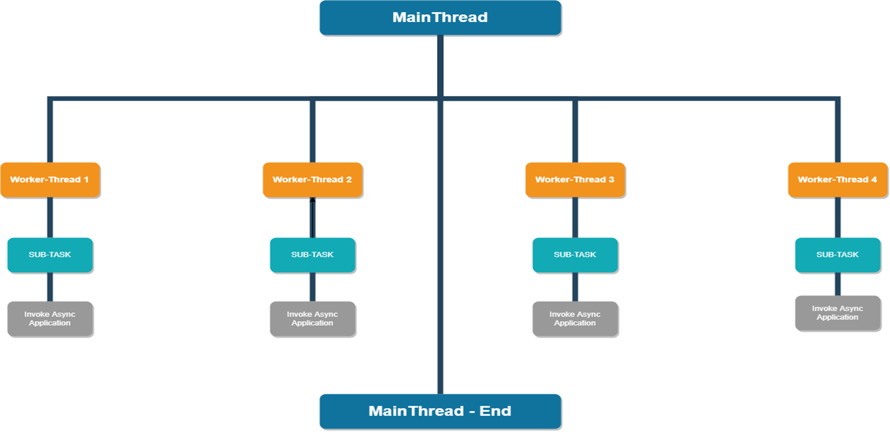
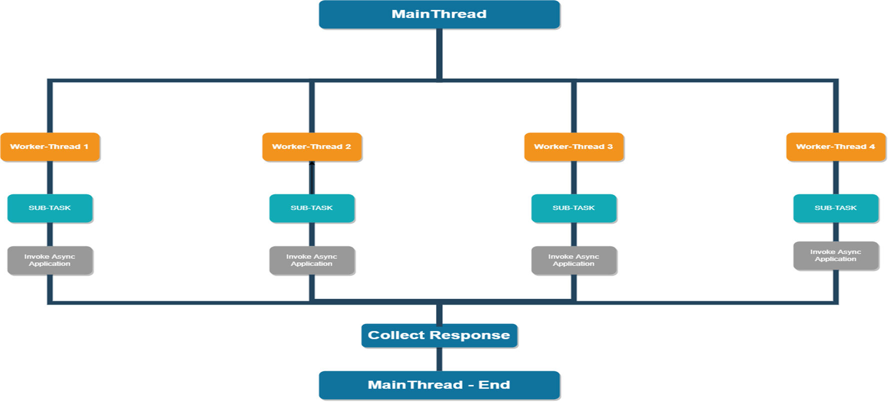

## Solace PubSub+ Spring MultiThreading Demo using Completable Future

## Author : Shreejit Panchal

## Git Repo
[Git Repo Path] https://github.com/shreejitpanchal/solace-springboot-multithreading-jms.

## Access a PubSub+ Service
The Spring Tutorials require that you have access to a PubSub+ Service. You can quickly set one up for FREE by following [these instructions](https://solace.com/try-it-now/)

## Please refer to Postman collection attached in project at below path:
./ Solace-Spring-MultiThread-CompletableFuture.postman_collection.json

## MultiThreading Asynchronous Patterns Covered in the Framework below:
1: FanOut Pattern 

2: Scatter/Gather Pattern

--- FAN OUT PATTERN ---



--- Scatter/Gather Pattern


## Prerequisites
1: Enable Lombok before mvn clean, Please follow instructions to enable lombok in Intellij :: 
https://projectlombok.org/setup/intellij 

2: Solace JMS specific know host port either local or remote "smf://<< HOST >>:<< PORT >>"


3: Maven Steps for Build & Install below:
``` bash
cd solace-springboot-multithreading-jms
mvn clean install
```

## Running the Samples

To try individual samples, go into the project directory and run the sample using maven.

``` bash
cd solace-springboot-multithreading-jms
mvn spring-boot:run
```

### Setting up your preferred IDE

Using a modern Java IDE provides cool productivity features like auto-completion, on-the-fly compilation, assisted refactoring and debugging which can be useful when you're exploring the samples and even modifying the samples. Follow the steps below for your preferred IDE.

This repository uses Maven projects. If you would like to import the projects into your favorite IDE you should be able to import them as Maven Projects. For examples, in eclipse choose "File -> Import -> Maven -> Existing Maven Projects -> Next -> Browse for your repo -> Select which projects -> Click Finish"

## License

This project is licensed under the Apache License, Version 2.0. - See the [LICENSE](LICENSE) file for details.

## Resources

For more information try these resources:

- [Tutorials](https://tutorials.solace.dev/)
- The Solace Developer Portal website at: [Developer Portal](http://solace.com/developers)
- Check out the [Solace blog](https://solace.com/blog/category/developers/) for other interesting discussions around Solace technology
- Follow our Developer Advocates on Twitter for development tips & to keep up with the latest Solace news! [@SolaceDevs](https://twitter.com/solacedevs)
